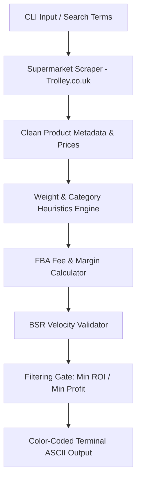

# 🇬🇧 UK Grocery Arbitrage Scanner: Supermarket-to-Amazon Matcher

A modular, zero-dependency Python command-line utility and scraping engine built to automate retail and online arbitrage (OA/RA) discovery in the UK. 

By aggregating live grocery pricing from major UK supermarkets (Asda, Tesco, Sainsbury's, Morrisons, Aldi, and Lidl) via price indices, and matching them against Amazon UK product catalogs, this engine evaluates Best Sellers Rank (BSR) velocity, calculates dynamic FBA fees, and highlights high-yield, high-margin resale opportunities.

---

## 📐 System Architecture

The tool combines lightweight web requests and raw HTML parsing with structured e-commerce financial algorithms:



---

## 🛠️ Key Architectural Components

### 1. Zero-Dependency Scraper
Instead of relying on fragile, heavy automated browser runtimes (like Selenium or Playwright) which trigger supermarket Cloudflare challenges instantly, this scanner utilizes lightweight `urllib.request` sockets layered with custom stealth user-agents and raw HTML node parsing via `BeautifulSoup`. 

### 2. Physical Metric Heuristics
Because raw supermarket datasets do not list official package weights and volumetric classes needed for Amazon FBA billing, the scanner implements a regex-driven **volumetric extraction engine** to parse package sizes directly from product titles (e.g., `454g`, `800g`, `50ml`, `1.5L`) and maps them to standard UK postal and weight tiers.

### 3. FBA Financial Modeling
Integrates precise Amazon UK FBA fee formulas, including:
*   **Variable Referral Fees:** Standard 15% rate, with automated scale reductions (8% fee) for grocery products priced under £10.00.
*   **Volumetric Postage Tiers:** Automatically applies Large Envelope, Standard Parcel, or Heavy Parcel shipping matrices based on computed weight ranges.
*   **Storage Overhead:** Integrates monthly cubic-foot warehouse storage estimates.

### 4. BSR Health Evaluation
Rather than treating Amazon's Best Sellers Rank (BSR) as a meaningless static number, the scanner's decision engine converts category BSRs into active **monthly sales velocities** utilizing specialized category benchmarks, country scales, and trend tracking.

---

## 📦 Project Structure

```text
grocery-arbitrage-scanner/
├── scanner.py          # Main Python executable and business logic
├── requirements.txt    # Small footprint dependency list
└── README.md           # Premium developer-facing documentation
```

---

## 🚀 Quick Start

### 1. Clone the Repository
```bash
git clone https://github.com/KhoaTheBest/grocery-arbitrage-scanner.git
cd grocery-arbitrage-scanner
```

### 2. Install Dependencies
This project is built with lightweight footprints in mind. It only requires `BeautifulSoup4` for parsing:
```bash
uv pip install -r requirements.txt
# or standard pip
pip install -r requirements.txt
```

### 3. Execute the Scanner

**Offline Showcase Mode (Instant Run):**
Run the scanner using the built-in, pre-scanned arbitrage list. This bypasses supermarket IP rate-limiting and lets you test calculations and outputs instantly:
```bash
python3 scanner.py --mock
```

**Live Sourcing Mode (Custom Keywords):**
Scan live portals for active deals on specific high-margin brands (e.g., premium coffees, baby formulas, skincare):
```bash
python3 scanner.py --search "CeraVe, Aptamil, Vitabiotics" --min-roi 30 --min-profit 3.00
```

---

## 📊 Example Console Output

```text
======================================================
🇬🇧  UK SUPERMARKET TO AMAZON FBA ARBITRAGE SCANNER  🇬🇧
======================================================
[✓] Successfully scanned 7 live matching items from portals!

==================== ARBITRAGE SCAN REPORT ====================

• CeraVe - Moisturising Cream 454g
  🛒 Supermarket: Sainsbury's | Price: £10.50
  📦 Amazon UK: Price: £19.99 | Category: Beauty
  💵 Amazon FBA Fees: £3.93 (Referral: £3.00, Shipping: £2.85)
  📈 Profit Metrics: Net Profit: £5.56 | ROI: 53.0% | Margin: 27.8%
  📊 BSR Rank: #450 | BSR Health: Excellent (Fast-moving, highly reliable inventory)
  -------------------------------------------------------------

• L'Or - Espresso Onyx Coffee Pods x40
  🛒 Supermarket: Tesco | Price: £8.00
  📦 Amazon UK: Price: £17.50 | Category: Grocery
  💵 Amazon FBA Fees: £3.93 (Referral: £1.40, Shipping: £2.45)
  📈 Profit Metrics: Net Profit: £5.57 | ROI: 69.6% | Margin: 31.8%
  📊 BSR Rank: #850 | BSR Health: Healthy (Sweet spot for retail & online arbitrage)
  -------------------------------------------------------------

[✓] Successfully located 2 high-margin arbitrage matches.
```

---

## ⚖️ License
Distributed under the MIT License. See `LICENSE` for details.
